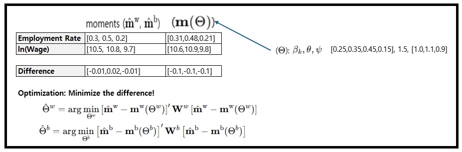

### This page is for replicating the AER paper (by Python).
#### *Updated: 2024-12-24 (Hyunwoo Woo & Emmanuel Yimfor)

- STARTING PATH: "replication/code/model"
  - (e.g., the path of "m0_model_run_all.py" should be "replication/code/model/m0_model_run_all.py")
  - (e.g., the path of "create_tables.py" should be "replication/code/model/depends/create_tables")

- Steps
(1) You should make a new folder (name = "replication") to run the codes after downloading this page.

(2) Then, make a sub-folder (name = "code") and its sub-folder (name = "model").

(3) In doing so, the whole files and the folder of this page should be put into the "replication/code/model" folder.

#### *Minimum Distance Estimation process:

